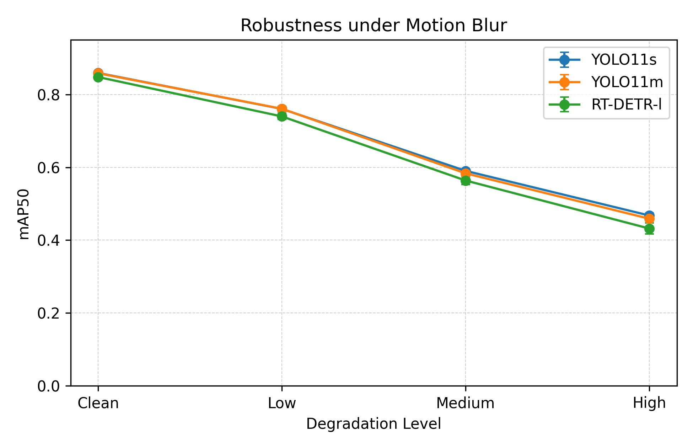
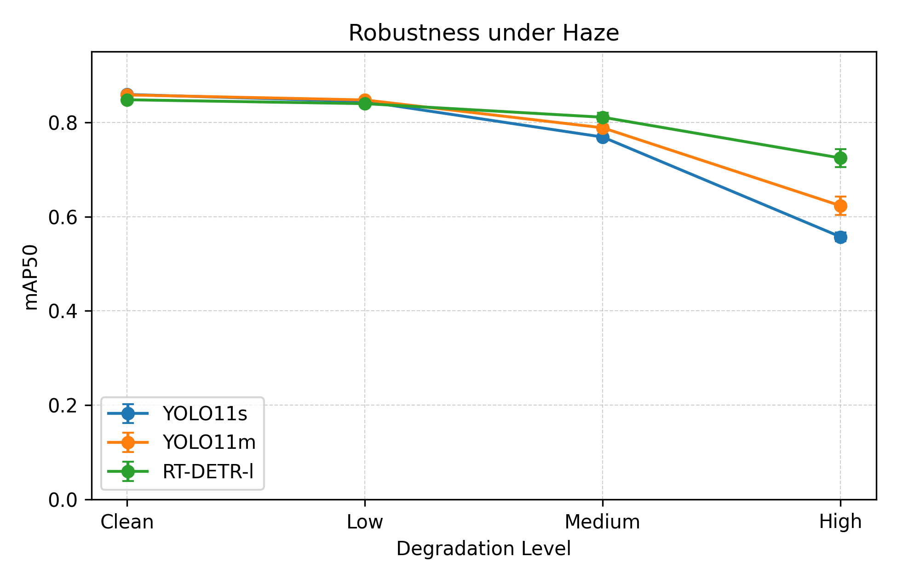
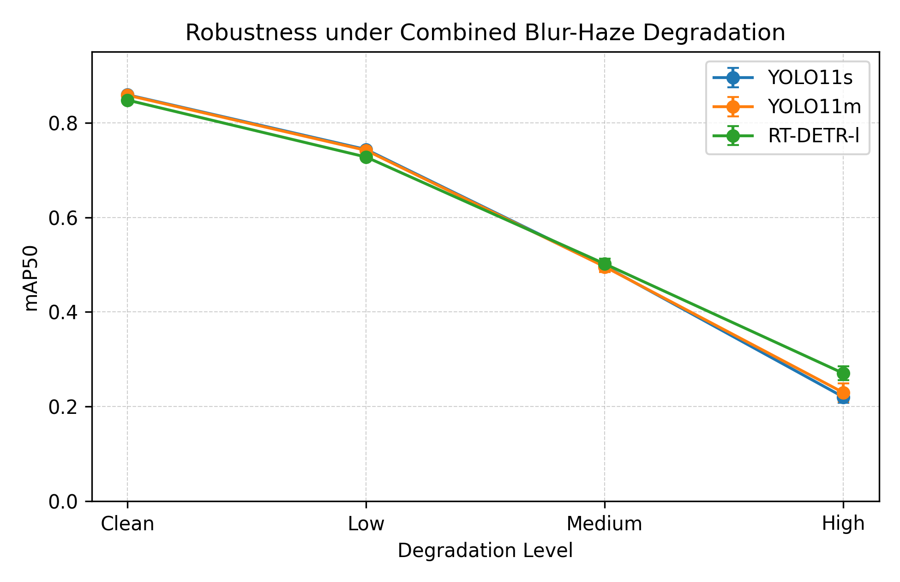
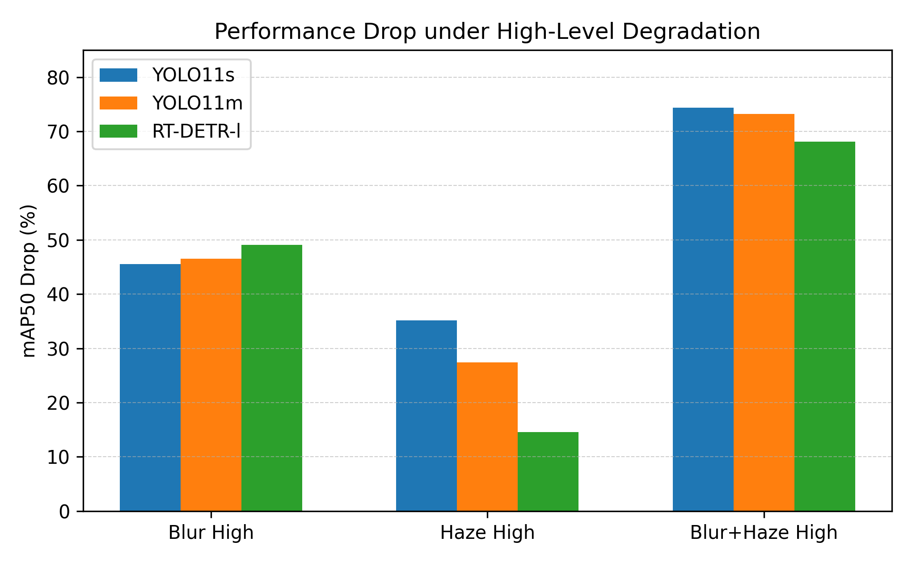
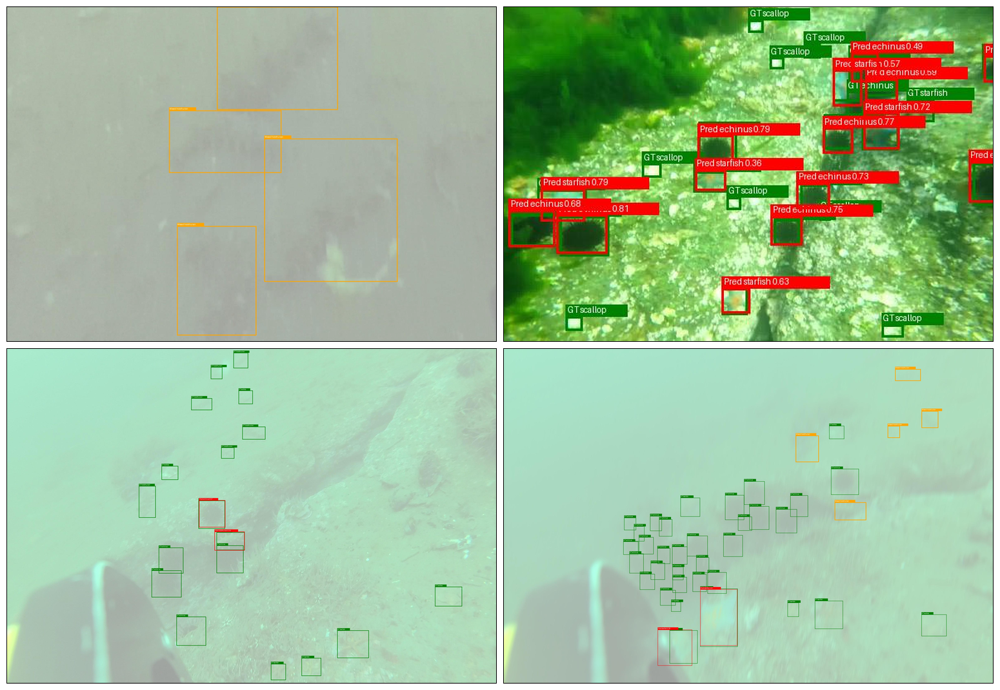

# Underwater Object Detection and Robustness Evaluation

## 1. Project Overview

This project focuses on underwater object detection for marine species, including holothurian, echinus, scallop, and starfish.

The goal is to build and evaluate a complete object detection pipeline under both clean and degraded underwater image conditions. The project includes dataset preprocessing, annotation conversion, 5-fold cross-validation, model comparison, robustness benchmark construction, and failure case analysis.

This project was originally developed for a practical machine learning course and later organized as a portfolio project to demonstrate experience in computer vision, model evaluation, and robustness analysis.

---

## 2. Main Contributions

My main work includes:

* Converted original XML annotations into YOLO format.
* Prepared a fixed test set and 5-fold train/validation splits.
* Trained and evaluated YOLO11, RT-DETR, and Faster R-CNN models.
* Designed synthetic robustness benchmarks using blur, haze, and combined blur-haze degradation.
* Compared model performance using Precision, Recall, mAP50, and mAP50-95.
* Analyzed failure cases, especially for small scallops and low-contrast holothurians.

---

## 3. Dataset

The dataset contains 5455 underwater images with four target classes:

| Class ID | Class       |
| -------- | ----------- |
| 0        | holothurian |
| 1        | echinus     |
| 2        | scallop     |
| 3        | starfish    |

A fixed test set of 550 images was used for final evaluation.
The remaining 4905 images were used for 5-fold cross-validation.

Original annotations were stored in XML format and converted into YOLO format for model training.

---

## 4. Models

The following object detection models were evaluated:

* YOLO11s
* YOLO11m
* RT-DETR-l
* Faster R-CNN with ResNet50-FPN

YOLO11s, YOLO11m, and RT-DETR-l were evaluated using 5-fold cross-validation.
Faster R-CNN was evaluated on fold 1 due to computational constraints.

---

## 5. Robustness Benchmark

To evaluate model robustness under degraded underwater image conditions, three types of synthetic degradation were generated:

* Motion blur
* Haze
* Combined blur and haze

Each degradation type contains three severity levels:

* Low
* Medium
* High

The bounding box annotations were reused because image degradation does not change object locations.

---

## 6. Clean Test Results

| Model                     | Precision | Recall |  mAP50 | mAP50-95 | Notes          |
| ------------------------- | --------: | -----: | -----: | -------: | -------------- |
| YOLO11s                   |    0.8343 | 0.7946 | 0.8590 |   0.5112 | 5-fold average |
| YOLO11m                   |    0.8299 | 0.8004 | 0.8532 |   0.5091 | 5-fold average |
| RT-DETR-l                 |    0.8050 | 0.7882 | 0.8478 |   0.4891 | 5-fold average |
| Faster R-CNN ResNet50-FPN |    0.8203 | 0.7516 | 0.8409 |   0.4711 | Fold 1 only    |

---

## 7. Key Findings

* YOLO11s achieved the best overall performance on the clean test set.
* YOLO11m achieved similar recall but did not improve overall mAP compared with YOLO11s.
* RT-DETR-l showed competitive recall but lower precision and mAP compared with YOLO11.
* Model performance decreased under degraded image conditions.
* Combined blur and haze caused the most severe performance drop.
* Small scallops were frequently missed due to their small object size.
* Low-contrast holothurians were difficult to detect under camouflage-like underwater backgrounds.

---

## 8. Robustness Visualization

<p align="center">
  
</p>

<p align="center">
  
</p>

<p align="center">
  
</p>

<p align="center">
  
</p>

---

## 9. Failure Case Analysis

The main failure cases were small scallops and low-contrast holothurians. Small scallops were often missed due to their small object size, while holothurians were difficult to detect under low-contrast and camouflage-like underwater backgrounds.



---

## 10. Project Structure

```text
configs/      Configuration files
data/         Dataset description only
docs/         Project summary, experiment notes, and interview script
figures/      Workflow figures, robustness plots, and failure cases
results/      Final result tables
scripts/      Preprocessing, training, evaluation, robustness, and augmentation scripts
```

---

## 11. Main Workflow

```text
Raw Images + XML Annotations
        ↓
XML to YOLO Conversion
        ↓
Fixed Test Set + 5-Fold Split
        ↓
Model Training
        ↓
Clean Test Evaluation
        ↓
Blur / Haze / Combined Robustness Benchmark
        ↓
Robustness Evaluation
        ↓
Failure Case Analysis
```

---

## 12. How to Run

The scripts are organized by function.

### Data preprocessing

```bash
python scripts/preprocessing/convert_data.py
```

### 5-fold training

```bash
python scripts/training/kfold_train.py
```

### Robustness benchmark generation

```bash
python scripts/robustness/generate_robustness_benchmark_2.0.py
```

### Result collection

```bash
python scripts/evaluation/collect_yolo11s_test_results.py
```

Note: Some scripts may require path modification depending on the local dataset location.

---

## 13. Limitations

* The dataset is not included in this repository due to storage size and usage restrictions.
* Model weights are not included due to file size limitations.
* Faster R-CNN was evaluated only on fold 1.
* The robustness benchmark uses synthetic degradation and may not fully represent all real underwater conditions.

---

## 14. Future Work

Possible future improvements include:

* Testing underwater image enhancement methods before detection.
* Improving small-object detection for scallops.
* Improving low-contrast target detection for holothurians.
* Evaluating domain adaptation methods for real degraded underwater scenes.
* Integrating detection outputs into a simple robotic perception pipeline.
